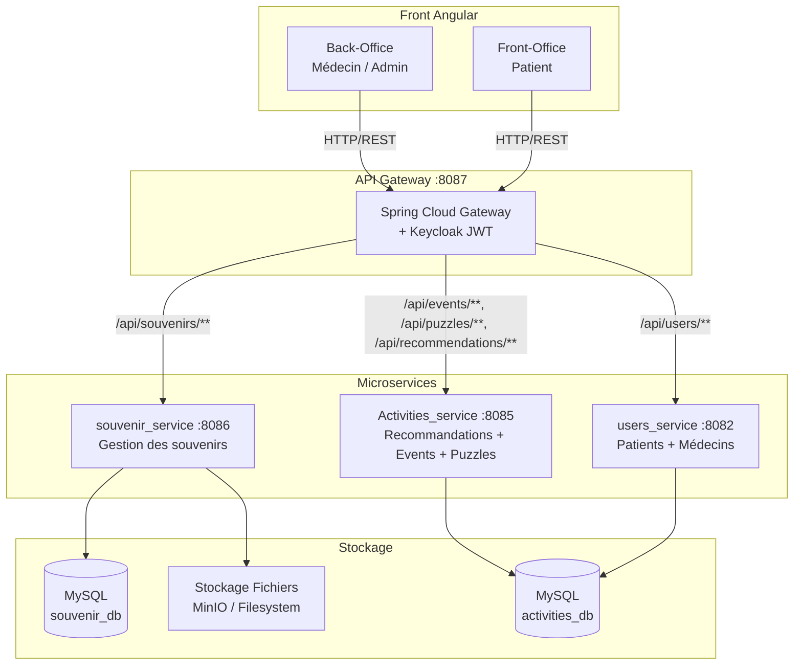
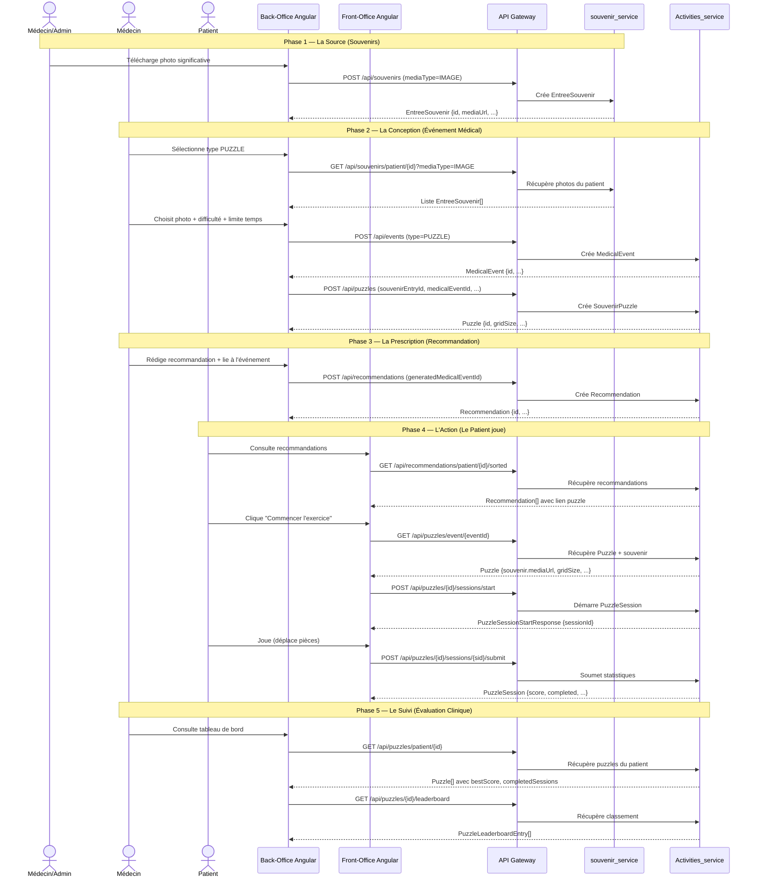

# Document de Conception : Puzzle Therapy

## Vue d'ensemble

Le système **Puzzle Therapy** est une fonctionnalité thérapeutique intégrée à la plateforme MindCare pour les patients atteints d'Alzheimer. Il permet aux médecins de prescrire des puzzles personnalisés basés sur les souvenirs photographiques du patient, et aux patients de jouer à ces puzzles depuis leur interface Front-Office, tandis que les médecins suivent la progression clinique via leur tableau de bord.

Le système s'articule en **5 phases** : (1) gestion des souvenirs photographiques, (2) création d'un événement médical de type PUZZLE lié à un souvenir, (3) prescription via une recommandation, (4) jeu interactif côté patient avec soumission des statistiques, et (5) suivi clinique par le médecin. Il s'intègre dans l'architecture microservices existante en s'appuyant sur le `souvenir_service` (port 8086) et le `Activities_service` / service de recommandations (port 8085).

---

## Architecture Haut Niveau

### Vue d'ensemble des microservices



### Flux des 5 phases



---

## Composants et Interfaces

### Composant 1 : souvenir_service (existant — étendu)

**Rôle** : Stocker et servir les souvenirs photographiques des patients.

**Interface REST** :
```
GET  /api/souvenirs/patient/{patientId}?mediaType=IMAGE   → EntreeSouvenir[]
POST /api/souvenirs                                        → EntreeSouvenir
```

**Responsabilités** :
- Persister les métadonnées des souvenirs (patientId, mediaUrl, mediaType, texte)
- Filtrer par `mediaType=IMAGE` pour la sélection puzzle
- Retourner un `SouvenirSourceSummary` embarqué dans la réponse Puzzle

### Composant 2 : Activities_service — Module Puzzle (nouveau)

**Rôle** : Gérer le cycle de vie complet des puzzles thérapeutiques.

**Interface REST** :
```
POST   /api/puzzles                                        → Puzzle
GET    /api/puzzles/{puzzleId}                             → Puzzle
GET    /api/puzzles/event/{eventId}                        → Puzzle
GET    /api/puzzles/patient/{patientId}                    → Puzzle[]
POST   /api/puzzles/{puzzleId}/sessions/start              → PuzzleSessionStartResponse
POST   /api/puzzles/{puzzleId}/sessions/{sessionId}/submit → PuzzleSession
GET    /api/puzzles/{puzzleId}/sessions/patient/{patientId}→ PuzzleSession[]
GET    /api/puzzles/{puzzleId}/leaderboard                 → PuzzleLeaderboardEntry[]
```

**Responsabilités** :
- Créer un `SouvenirPuzzle` lié à un `MedicalEvent` et une `EntreeSouvenir`
- Calculer le `gridSize` selon la difficulté (EASY=3, MEDIUM=4, HARD=5)
- Gérer les sessions de jeu (démarrage, soumission, statistiques)
- Calculer le score final et mettre à jour `bestScore`
- Exposer le classement des patients

### Composant 3 : Back-Office Angular — Module Puzzle (nouveau)

**Rôle** : Interface médecin pour créer et superviser les puzzles.

**Composants Angular** :
```
backoffice/
  puzzle-management/
    puzzle-management.ts          ← Composant principal (liste + création)
    puzzle-management.html
    puzzle-management.css
    puzzle-dashboard.ts           ← Tableau de bord suivi clinique
    puzzle-dashboard.html
    puzzle-dashboard.css
```

**Responsabilités** :
- Afficher la grille de suggestions de photos (souvenirs IMAGE du patient)
- Formulaire de création puzzle (difficulté, limite temps, indices max)
- Tableau de bord clinique : progression, abandons, recommandations de difficulté

### Composant 4 : Front-Office Angular — Module Puzzle (existant — amélioré)

**Rôle** : Interface patient pour jouer au puzzle.

**Composants Angular** :
```
frontoffice/
  puzzle-play/
    puzzle-play.ts    ← Jeu de puzzle (sliding puzzle)
    puzzle-play.html
    puzzle-play.css
```

**Responsabilités** :
- Charger le puzzle depuis l'événement médical lié à la recommandation
- Découper visuellement la photo en grille CSS (background-position)
- Gérer le chronomètre, les mouvements, les indices
- Soumettre les statistiques à la fin de la session

---

## Modèles de Données

### Entité : SouvenirPuzzle (Activities_service)

```java
@Entity
@Table(name = "souvenir_puzzles")
public class SouvenirPuzzle {
    @Id
    @GeneratedValue(strategy = GenerationType.IDENTITY)
    private Long id;

    @OneToOne
    @JoinColumn(name = "medical_event_id", unique = true)
    private MedicalEvent medicalEvent;

    private Long souvenirEntryId;   // Référence vers souvenir_service
    private Long patientId;

    private String title;
    private String description;

    @Enumerated(EnumType.STRING)
    private DifficultyLevel difficulty;  // EASY | MEDIUM | HARD

    private Integer gridSize;            // 3 | 4 | 5 (calculé depuis difficulty)
    private Integer timeLimitSeconds;    // null = pas de limite
    private Integer maxHints;            // défaut : 3

    @Enumerated(EnumType.STRING)
    private PuzzleStatus status;         // ACTIVE | COMPLETED | ARCHIVED

    private Integer bestScore;
    private Integer completedSessions;

    private LocalDateTime startDate;
    private LocalDateTime endDate;
    private LocalDateTime createdAt;
    private LocalDateTime updatedAt;
}
```

### Entité : PuzzleSession (Activities_service)

```java
@Entity
@Table(name = "puzzle_sessions")
public class PuzzleSession {
    @Id
    @GeneratedValue(strategy = GenerationType.IDENTITY)
    private Long id;

    @ManyToOne
    @JoinColumn(name = "puzzle_id")
    private SouvenirPuzzle puzzle;

    private Long patientId;
    private LocalDateTime startedAt;
    private LocalDateTime finishedAt;

    private Integer durationSeconds;
    private Integer movesCount;
    private Integer errorsCount;
    private Integer hintsUsed;
    private Double completionPercent;
    private Integer score;

    private Boolean completed;
    private Boolean abandoned;

    private LocalDateTime createdAt;
}
```

### Entité : MedicalEvent (existante — inchangée)

```java
// Champs pertinents pour le puzzle
private MedicalEventType type;   // PUZZLE
private DifficultyLevel difficulty;
private Long patientId;
// Relation 1:1 avec SouvenirPuzzle via medicalEvent.id
```

### Entité : Recommendation (existante — inchangée)

```java
// Champ clé pour le lien puzzle
private Long generatedMedicalEventId;  // → MedicalEvent.id → SouvenirPuzzle
```

### DTO de transfert

```java
// Requête de création puzzle
public record PuzzleCreateRequest(
    Long souvenirEntryId,
    Long patientId,
    String title,
    String description,
    DifficultyLevel difficulty,
    Integer timeLimitSeconds,
    Integer maxHints,
    LocalDateTime startDate,
    LocalDateTime endDate
) {}

// Réponse puzzle enrichie (avec souvenir embarqué)
public record PuzzleResponse(
    Long id,
    Long medicalEventId,
    Long souvenirEntryId,
    Long patientId,
    String title,
    String description,
    DifficultyLevel difficulty,
    Integer gridSize,
    Integer timeLimitSeconds,
    Integer maxHints,
    PuzzleStatus status,
    Integer bestScore,
    Integer completedSessions,
    SouvenirSourceSummary souvenir,  // Récupéré via Feign/RestTemplate
    LocalDateTime createdAt,
    LocalDateTime updatedAt
) {}

// Résumé souvenir embarqué
public record SouvenirSourceSummary(
    Long id,
    Long patientId,
    String mediaType,
    String mediaUrl,
    String mediaTitle,
    String texte
) {}

// Soumission de session
public record PuzzleSessionSubmitRequest(
    Long patientId,
    Integer durationSeconds,
    Integer movesCount,
    Integer errorsCount,
    Integer hintsUsed,
    Double completionPercent,
    Boolean completed,
    Boolean abandoned
) {}
```

---

## Conception Bas Niveau

### Algorithme de calcul du gridSize

```java
/**
 * Calcule la taille de la grille selon la difficulté.
 * Précondition  : difficulty != null
 * Postcondition : gridSize ∈ {3, 4, 5}
 */
public static int computeGridSize(DifficultyLevel difficulty) {
    return switch (difficulty) {
        case EASY   -> 3;   // 3×3 = 8 pièces + 1 vide
        case MEDIUM -> 4;   // 4×4 = 15 pièces + 1 vide
        case HARD   -> 5;   // 5×5 = 24 pièces + 1 vide
    };
}
```

### Algorithme de calcul du score

```java
/**
 * Calcule le score final d'une session de puzzle.
 *
 * Préconditions :
 *   - durationSeconds >= 0
 *   - movesCount >= 0
 *   - hintsUsed >= 0
 *   - completionPercent ∈ [0.0, 100.0]
 *   - timeLimitSeconds > 0 si non null
 *
 * Postconditions :
 *   - score ∈ [0, 1000]
 *   - Si completed == false : score <= 500
 *   - Si hintsUsed > 0 : score < score_sans_indice
 */
public int calculateScore(
    boolean completed,
    double completionPercent,
    int durationSeconds,
    int movesCount,
    int hintsUsed,
    Integer timeLimitSeconds
) {
    if (!completed) {
        // Score partiel basé sur le pourcentage de complétion
        return (int) (completionPercent * 5.0);  // max 500
    }

    int baseScore = 1000;

    // Pénalité temps : -1 point par seconde au-delà de la limite
    if (timeLimitSeconds != null && durationSeconds > timeLimitSeconds) {
        int overtime = durationSeconds - timeLimitSeconds;
        baseScore -= Math.min(overtime, 300);  // max -300
    }

    // Pénalité mouvements : -2 points par mouvement excessif
    int gridSize = /* injecté */ 3;
    int optimalMoves = gridSize * gridSize * 2;
    if (movesCount > optimalMoves) {
        baseScore -= Math.min((movesCount - optimalMoves) * 2, 200);  // max -200
    }

    // Pénalité indices : -50 points par indice utilisé
    baseScore -= hintsUsed * 50;

    return Math.max(0, baseScore);
}
```

### Algorithme de vérification de résolution (côté Angular)

```typescript
/**
 * Vérifie si le puzzle est résolu.
 * Un puzzle est résolu quand chaque tuile est à sa position d'origine.
 * La tuile vide (valeur = tileCount - 1) doit être en dernière position.
 *
 * Précondition  : values.length == gridSize * gridSize
 * Postcondition : retourne true ssi ∀i, values[i] == i
 */
private isSolved(values: number[]): boolean {
    return values.every((value, index) => value === index);
}

/**
 * Vérifie si deux tuiles sont adjacentes (déplacement valide).
 * Utilise la distance de Manhattan = 1.
 *
 * Précondition  : indexA, indexB ∈ [0, gridSize²[
 * Postcondition : retourne true ssi |rowA-rowB| + |colA-colB| == 1
 */
private isAdjacent(indexA: number, indexB: number): boolean {
    const gridSize = this.puzzle?.gridSize ?? 3;
    const rowA = Math.floor(indexA / gridSize);
    const colA = indexA % gridSize;
    const rowB = Math.floor(indexB / gridSize);
    const colB = indexB % gridSize;
    return Math.abs(rowA - rowB) + Math.abs(colA - colB) === 1;
}
```

### Algorithme de rendu CSS des tuiles (côté Angular)

```typescript
/**
 * Calcule le style CSS d'une tuile pour afficher la portion correcte de l'image.
 * Utilise background-position pour simuler le découpage de la photo.
 *
 * Précondition  : tile.value ∈ [0, gridSize²-1], sourceImage != ''
 * Postcondition : retourne un objet de style CSS valide
 *
 * Invariant de boucle (rendu de grille) :
 *   Pour chaque tuile i traitée, backgroundPosition est calculé
 *   de façon indépendante et ne dépend que de tile.value et gridSize.
 */
tileStyle(tile: PuzzleTile): Record<string, string> {
    if (!this.puzzle || tile.isEmpty) return {};

    const gridSize = this.puzzle.gridSize;
    const row = Math.floor(tile.value / gridSize);
    const col = tile.value % gridSize;
    const denominator = Math.max(gridSize - 1, 1);

    return {
        backgroundImage: `url(${this.sourceImage})`,
        backgroundSize: `${gridSize * 100}% ${gridSize * 100}%`,
        backgroundPosition: `${(col / denominator) * 100}% ${(row / denominator) * 100}%`,
    };
}
```

---

## Contrats API Détaillés

### POST /api/puzzles — Créer un puzzle

**Requête** :
```json
{
  "souvenirEntryId": 42,
  "patientId": 7,
  "title": "Notre mariage",
  "description": "Photo du mariage de 1985",
  "difficulty": "MEDIUM",
  "timeLimitSeconds": 300,
  "maxHints": 3,
  "startDate": "2025-01-15T00:00:00",
  "endDate": "2025-02-15T00:00:00"
}
```

**Réponse 201** :
```json
{
  "id": 15,
  "medicalEventId": 23,
  "souvenirEntryId": 42,
  "patientId": 7,
  "title": "Notre mariage",
  "difficulty": "MEDIUM",
  "gridSize": 4,
  "timeLimitSeconds": 300,
  "maxHints": 3,
  "status": "ACTIVE",
  "bestScore": null,
  "completedSessions": 0,
  "souvenir": {
    "id": 42,
    "patientId": 7,
    "mediaType": "IMAGE",
    "mediaUrl": "http://localhost:8086/files/patient7/mariage.jpg",
    "mediaTitle": "Mariage 1985",
    "texte": "Photo du mariage de Jean et Marie"
  },
  "createdAt": "2025-01-15T10:30:00"
}
```

**Erreurs** :
- `400` : souvenirEntryId manquant, difficulté invalide
- `404` : souvenirEntryId ou patientId introuvable
- `409` : Un puzzle existe déjà pour cet événement médical

### POST /api/puzzles/{puzzleId}/sessions/start — Démarrer une session

**Paramètre** : `?patientId=7`

**Réponse 201** :
```json
{
  "sessionId": 88,
  "puzzleId": 15,
  "patientId": 7,
  "startedAt": "2025-01-20T14:00:00"
}
```

**Erreurs** :
- `403` : Le patient ne correspond pas au puzzle
- `404` : Puzzle introuvable

### POST /api/puzzles/{puzzleId}/sessions/{sessionId}/submit — Soumettre une session

**Requête** :
```json
{
  "patientId": 7,
  "durationSeconds": 245,
  "movesCount": 87,
  "errorsCount": 12,
  "hintsUsed": 1,
  "completionPercent": 100.0,
  "completed": true,
  "abandoned": false
}
```

**Réponse 200** :
```json
{
  "id": 88,
  "puzzleId": 15,
  "patientId": 7,
  "startedAt": "2025-01-20T14:00:00",
  "finishedAt": "2025-01-20T14:04:05",
  "durationSeconds": 245,
  "movesCount": 87,
  "errorsCount": 12,
  "hintsUsed": 1,
  "completionPercent": 100.0,
  "score": 850,
  "completed": true,
  "abandoned": false
}
```

### GET /api/puzzles/patient/{patientId} — Tableau de bord médecin

**Réponse 200** :
```json
[
  {
    "id": 15,
    "patientId": 7,
    "title": "Notre mariage",
    "difficulty": "MEDIUM",
    "gridSize": 4,
    "status": "ACTIVE",
    "bestScore": 850,
    "completedSessions": 3,
    "souvenir": { "mediaUrl": "...", "mediaTitle": "Mariage 1985" }
  }
]
```

### GET /api/souvenirs/patient/{patientId}?mediaType=IMAGE — Grille de suggestions

**Réponse 200** :
```json
[
  {
    "id": 42,
    "patientId": 7,
    "mediaType": "IMAGE",
    "mediaUrl": "http://localhost:8086/files/patient7/mariage.jpg",
    "mediaTitle": "Mariage 1985",
    "texte": "Photo du mariage de Jean et Marie",
    "themeCulturel": "TRADITIONS"
  }
]
```

---

## Gestion des Erreurs

### Scénario 1 : Souvenir introuvable lors de la création puzzle

**Condition** : `souvenirEntryId` ne correspond à aucune entrée dans `souvenir_service`
**Réponse** : `404 Not Found` avec message `"Souvenir introuvable : id=42"`
**Récupération** : Le médecin sélectionne un autre souvenir dans la grille

### Scénario 2 : Session démarrée sur un puzzle expiré

**Condition** : `puzzle.endDate < now()` ou `puzzle.status == ARCHIVED`
**Réponse** : `400 Bad Request` avec message `"Ce puzzle n'est plus actif"`
**Récupération** : Le Front-Office affiche un message d'expiration et masque le bouton "Jouer"

### Scénario 3 : Soumission d'une session déjà soumise

**Condition** : `session.finishedAt != null`
**Réponse** : `409 Conflict` avec message `"Session déjà soumise"`
**Récupération** : Le client ignore l'erreur (idempotence côté Angular via flag `submitted`)

### Scénario 4 : Timeout de communication inter-services

**Condition** : `souvenir_service` ne répond pas lors de la récupération du souvenir embarqué
**Réponse** : `503 Service Unavailable` avec message `"Service souvenir indisponible"`
**Récupération** : Retourner le puzzle sans le champ `souvenir` (null), le Front-Office affiche une image de remplacement

### Scénario 5 : Patient non autorisé à jouer un puzzle

**Condition** : `session.patientId != puzzle.patientId`
**Réponse** : `403 Forbidden` avec message `"Ce puzzle n'appartient pas à ce patient"`
**Récupération** : Redirection vers la liste des recommandations

---

## Stratégie de Tests

### Tests Unitaires

- `PuzzleScoreCalculatorTest` : Vérifier le calcul du score pour tous les cas (complété, abandonné, avec/sans indices, dépassement temps)
- `GridSizeComputerTest` : Vérifier que EASY→3, MEDIUM→4, HARD→5
- `PuzzleSessionServiceTest` : Vérifier la logique de démarrage/soumission de session
- `SouvenirPuzzleServiceTest` : Vérifier la création, la validation, la mise à jour du bestScore

### Tests Basés sur les Propriétés (Property-Based Testing)

**Bibliothèque** : JUnit 5 + jqwik (Java)

**Propriété 1 — Score borné** :
```
∀ session valide : calculateScore(session) ∈ [0, 1000]
```

**Propriété 2 — Monotonie du score** :
```
∀ s1, s2 : s1.hintsUsed < s2.hintsUsed ∧ autres_params_égaux
  ⟹ calculateScore(s1) >= calculateScore(s2)
```

**Propriété 3 — gridSize cohérent** :
```
∀ difficulty ∈ {EASY, MEDIUM, HARD} :
  computeGridSize(difficulty)² == nombre_de_tuiles(puzzle)
```

**Propriété 4 — Résolution puzzle** :
```
∀ grille résolue : isSolved(grille) == true
∀ grille mélangée valide : isSolved(grille) == false (avec haute probabilité)
```

### Tests d'Intégration

- Flux complet Phase 2→4 : création puzzle → démarrage session → soumission → vérification score
- Communication `Activities_service` → `souvenir_service` : récupération du souvenir embarqué
- Routage API Gateway : vérifier que `/api/puzzles/**` est correctement routé vers le port 8085

---

## Considérations de Performance

- **Chargement de l'image** : L'image est chargée une seule fois via CSS `background-image`. Le découpage en tuiles est purement CSS (pas de canvas, pas de traitement serveur).
- **Pagination** : `GET /api/puzzles/patient/{id}` peut retourner beaucoup de puzzles — prévoir une pagination (`?page=0&size=10`) si le patient a un historique long.
- **Cache souvenir** : Le `SouvenirSourceSummary` est embarqué dans la réponse Puzzle pour éviter un appel supplémentaire côté client lors du chargement du jeu.
- **Timeout inter-services** : Configurer un timeout de 5 secondes sur les appels Feign/RestTemplate vers `souvenir_service` pour éviter les blocages en cascade.

---

## Considérations de Sécurité

- **Autorisation patient** : Vérifier que `session.patientId == puzzle.patientId` avant tout démarrage de session (côté backend).
- **Autorisation médecin** : Seuls les utilisateurs avec le rôle `DOCTOR` ou `ADMIN` peuvent créer des puzzles et consulter le tableau de bord clinique (via Keycloak JWT).
- **Validation des entrées** : `souvenirEntryId`, `patientId`, `timeLimitSeconds` doivent être validés (positifs, non nuls) avant persistance.
- **Isolation des données** : Un patient ne peut accéder qu'aux puzzles qui lui sont assignés (`puzzle.patientId == token.userId`).
- **Upload de photos** : Les photos téléchargées dans `souvenir_service` doivent être validées (type MIME image/*, taille max 10 Mo) pour éviter les injections de fichiers malveillants.

---

## Propriétés de Correction

*Une propriété est une caractéristique ou un comportement qui doit rester vrai pour toutes les exécutions valides du système — c'est une déclaration formelle de ce que le système doit faire. Les propriétés servent de pont entre les spécifications lisibles par l'humain et les garanties de correction vérifiables automatiquement.*

### Propriété 1 : Rendu complet des données puzzle

*Pour tout* tableau de puzzles chargé dans `PuzzleManagementPage`, chaque puzzle rendu doit exposer dans le DOM son titre, sa difficulté, son statut, son meilleur score (`bestScore`) et son nombre de sessions complétées (`completedSessions`).

**Valide : Exigence 1.2**

### Propriété 2 : Rendu complet des données de session

*Pour tout* tableau de sessions chargé dans `PuzzleManagementPage`, chaque session rendue doit exposer dans le DOM sa date, sa durée, son nombre de mouvements, son nombre d'erreurs, ses indices utilisés, son pourcentage de complétion et son score.

**Valide : Exigence 1.4**

### Propriété 3 : Visibilité conditionnelle du bouton "Commencer l'exercice"

*Pour tout* tableau de recommandations affiché dans `RecommendationsPage`, le bouton "Commencer l'exercice" doit apparaître si et seulement si la recommandation est de type `PUZZLE` **et** possède un `generatedMedicalEventId` non nul. Pour toute autre combinaison (type non PUZZLE, ou `generatedMedicalEventId` nul), le bouton ne doit pas être présent.

**Valide : Exigences 5.1, 5.3, 5.4**

---

## Dépendances

### Backend (Activities_service)
- Spring Boot 3.x
- Spring Data JPA + MySQL
- Spring Web (REST)
- Spring Cloud OpenFeign (communication avec souvenir_service)
- Lombok
- MapStruct (mapping DTO ↔ entité)
- jqwik (tests basés sur les propriétés)

### Backend (souvenir_service)
- Spring Boot 3.x (existant)
- Endpoint `GET /api/souvenirs/patient/{id}?mediaType=IMAGE` (existant)

### Frontend (Angular)
- Angular 21.x (existant)
- HttpClient (existant)
- RecommendationService (existant — étendu avec méthodes puzzle)
- SouvenirsService (existant — réutilisé pour la grille de suggestions)

### Infrastructure
- API Gateway Spring Cloud (existant — ajouter route `/api/puzzles/**`)
- Keycloak (existant — rôles DOCTOR, PATIENT, ADMIN)
- MySQL (existant — nouvelle base ou nouvelles tables dans `activities_db`)
