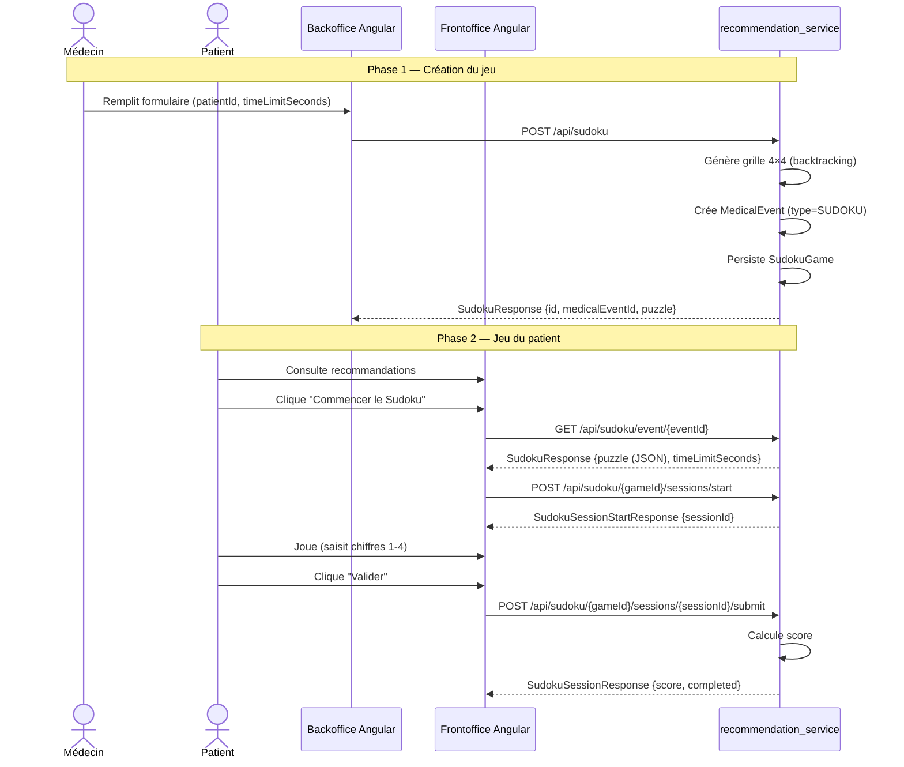

# Document de Conception : Sudoku Thérapeutique

## Vue d'ensemble

Le système **Sudoku Thérapeutique** est une fonctionnalité de stimulation cognitive intégrée à la plateforme MindCare pour les patients atteints d'Alzheimer. Il permet aux médecins de prescrire un jeu Sudoku 4×4 depuis le backoffice, et aux patients de jouer une session chronométrée depuis le frontoffice.

La fonctionnalité s'intègre dans le microservice `recommendation_service` (port 8085) en suivant les mêmes patterns architecturaux que le puzzle-souvenir déjà implémenté. Les entités (`SudokuGame`, `SudokuSession`), les DTOs, les repositories et les enums Java/TypeScript sont **déjà présents** dans le code. L'implémentation consiste à compléter les couches service, contrôleur, migration SQL et composants Angular.

---

## Architecture Haut Niveau

### Vue d'ensemble des composants

```
Front Angular (port 4200)
  ├── backoffice/sudoku-management/   ← Médecin : créer un jeu Sudoku
  └── frontoffice/sudoku-play/        ← Patient : jouer une session Sudoku

API Gateway (port 8087)
  └── /api/sudoku/**  →  recommendation_service (port 8085)

recommendation_service (port 8085)
  ├── SudokuController   ← Endpoints REST
  ├── SudokuService      ← Logique métier + génération de grille
  ├── SudokuGame         ← Entité JPA (table sudoku_games)
  ├── SudokuSession      ← Entité JPA (table sudoku_sessions)
  └── MedicalEvent       ← Entité existante (type SUDOKU)

MySQL (activities_db)
  ├── sudoku_games
  ├── sudoku_sessions
  ├── medical_events  (colonne type : ajouter SUDOKU)
  └── recommendations (colonne type : ajouter SUDOKU)
```

### Flux principal



---

## Composants et Interfaces

### Composant 1 : SudokuService (recommendation_service — à implémenter)

**Rôle** : Générer les grilles 4×4, gérer le cycle de vie des jeux et des sessions, calculer les scores.

**Méthodes publiques** :
```java
SudokuResponse   createGame(SudokuCreateRequest request)
SudokuResponse   getById(Long gameId)
SudokuResponse   getByEvent(Long eventId)
List<SudokuResponse> getByPatient(Long patientId)

SudokuSessionStartResponse  startSession(Long gameId, Long patientId)
SudokuSessionResponse       submitSession(Long gameId, Long sessionId, SudokuSessionSubmitRequest request)
List<SudokuSessionResponse> getSessionsByPatient(Long gameId, Long patientId)
```

**Dépendances injectées** :
- `SudokuGameRepository`
- `SudokuSessionRepository`
- `MedicalEventRepository`
- `ObjectMapper` (bean déclaré dans `RestClientConfig`)

### Composant 2 : SudokuController (recommendation_service — à implémenter)

**Rôle** : Exposer les endpoints REST du module Sudoku.

**Endpoints** :
```
POST   /api/sudoku                                    → 201 SudokuResponse
GET    /api/sudoku/event/{eventId}                    → 200 SudokuResponse
GET    /api/sudoku/patient/{patientId}                → 200 SudokuResponse[]
POST   /api/sudoku/{gameId}/sessions/start            → 201 SudokuSessionStartResponse
POST   /api/sudoku/{gameId}/sessions/{sessionId}/submit → 200 SudokuSessionResponse
GET    /api/sudoku/{gameId}/sessions                  → 200 SudokuSessionResponse[]
```

### Composant 3 : RestClientConfig (à compléter)

**Rôle** : Déclarer le bean `ObjectMapper` utilisé par `SudokuService` pour sérialiser/désérialiser les grilles `int[][]` en JSON.

**Bean à ajouter** :
```java
@Bean
public ObjectMapper objectMapper() {
    return new ObjectMapper()
        .configure(DeserializationFeature.FAIL_ON_UNKNOWN_PROPERTIES, false)
        .registerModule(new JavaTimeModule())
        .disable(SerializationFeature.WRITE_DATES_AS_TIMESTAMPS);
}
```

### Composant 4 : Migration SQL

**Rôle** : Ajouter la valeur `'SUDOKU'` aux colonnes `type` de type ENUM dans les tables `medical_events` et `recommendations`.

**Script** :
```sql
ALTER TABLE medical_events
  MODIFY COLUMN type ENUM(
    'MEMORY','FLUENCY','VISUOSPATIAL','ATTENTION',
    'PUZZLE','SUDOKU','MEDICATION','EXERCISE','DIET','LIFESTYLE','OTHER'
  ) NOT NULL;

ALTER TABLE recommendations
  MODIFY COLUMN type ENUM(
    'MEMORY','FLUENCY','PUZZLE','SUDOKU','VISUOSPATIAL',
    'ATTENTION','MEDICATION','EXERCISE','DIET','LIFESTYLE','OTHER'
  ) NOT NULL;
```

### Composant 5 : SudokuPlayPage (frontoffice Angular — à implémenter)

**Rôle** : Interface patient pour jouer une session Sudoku 4×4.

**Fichiers** :
```
frontoffice/sudoku-play/
  sudoku-play.ts    ← Logique du composant
  sudoku-play.html  ← Template (grille 4×4, chronomètre, overlay score)
  sudoku-play.css   ← Styles
```

**Comportement** :
1. Charge le `SudokuGame` via `GET /api/sudoku/event/{eventId}`
2. Parse le JSON `puzzle` en `number[][]`
3. Démarre automatiquement une session (`startSession`)
4. Lance le chronomètre
5. Affiche la grille 4×4 : cellules fixes non modifiables, cellules vides = `<input>` acceptant 1–4
6. Met en évidence les erreurs en temps réel (validation Sudoku locale)
7. Bouton "Valider" → soumet la session avec durée, erreurs, complétion
8. Overlay de succès avec score si `completed = true`

### Composant 6 : SudokuManagementPage (backoffice Angular — à créer)

**Rôle** : Interface médecin pour créer un jeu Sudoku pour un patient.

**Fichiers** :
```
backoffice/sudoku-management/
  sudoku-management.ts
  sudoku-management.html
  sudoku-management.css
```

**Formulaire** :
- `patientId` (nombre, obligatoire)
- `timeLimitSeconds` (nombre, défaut : 300)
- `difficulty` (fixe : EASY)
- Bouton "Créer le Sudoku"

**Comportement** :
- Validation locale avant appel API
- Appel `POST /api/sudoku`
- Affichage du message : `"Sudoku créé avec succès (event #<medicalEventId>)"`
- Réinitialisation du formulaire après succès

### Composant 7 : Mise à jour des enums TypeScript

**Fichier** : `front/src/app/backoffice/recommendation/recommendation.model.ts`

Les enums `MedicalEventType` et `RecommendationType` contiennent **déjà** la valeur `SUDOKU = 'SUDOKU'`. Aucune modification nécessaire.

### Composant 8 : Mise à jour du service Angular

**Fichier** : `front/src/app/backoffice/recommendation/recommendation.service.ts`

Les méthodes Sudoku (`getSudokuByEvent`, `startSudokuSession`, `submitSudokuSession`, `getSudokuSessions`, `createSudoku`) sont **déjà présentes**. Aucune modification nécessaire.

### Composant 9 : Bouton "Commencer le Sudoku" dans RecommendationsPage

**Fichier** : `front/src/app/frontoffice/recommendations/recommendations.html`

Ajouter un bloc conditionnel pour `rec.type === 'SUDOKU'` similaire au bloc PUZZLE existant, avec navigation vers `/sudoku-play/{generatedMedicalEventId}`.

---

## Modèles de Données

### Entité SudokuGame (existante)

```java
@Entity @Table(name = "sudoku_games")
public class SudokuGame {
    Long id;
    MedicalEvent medicalEvent;   // @ManyToOne
    Long patientId;
    DifficultyLevel difficulty;  // EASY = 4×4
    String puzzle;               // JSON "[[1,2,0,4],...]" — 0 = cellule vide
    String solution;             // JSON grille complète (non exposée au client)
    Integer gridSize;            // 4
    Integer timeLimitSeconds;    // défaut 300
    Boolean active;
    Integer bestScore;
    Integer completedSessions;
    LocalDateTime createdAt;
    LocalDateTime updatedAt;
}
```

### Entité SudokuSession (existante)

```java
@Entity @Table(name = "sudoku_sessions")
public class SudokuSession {
    Long id;
    SudokuGame sudokuGame;       // @ManyToOne
    Long patientId;
    LocalDateTime startedAt;
    LocalDateTime finishedAt;    // null tant que non soumise
    Integer durationSeconds;
    Integer errorsCount;
    Integer hintsUsed;
    Integer completionPercent;
    Integer score;
    Boolean completed;
    Boolean abandoned;
    LocalDateTime createdAt;
}
```

### DTOs (existants)

| DTO | Direction | Champs clés |
|-----|-----------|-------------|
| `SudokuCreateRequest` | Requête création | `patientId`, `difficulty`, `timeLimitSeconds`, `title` |
| `SudokuResponse` | Réponse jeu | `id`, `medicalEventId`, `puzzle` (JSON), `gridSize`, `timeLimitSeconds` |
| `SudokuSessionStartResponse` | Réponse démarrage | `sessionId`, `gameId`, `patientId`, `startedAt` |
| `SudokuSessionSubmitRequest` | Requête soumission | `patientId`, `durationSeconds`, `errorsCount`, `hintsUsed`, `completionPercent`, `completed`, `abandoned` |
| `SudokuSessionResponse` | Réponse session | `id`, `score`, `completed`, `abandoned`, `durationSeconds` |

---

## Conception Bas Niveau

### Algorithme de génération de grille 4×4 (backtracking)

```java
/**
 * Génère une grille solution 4×4 valide par backtracking.
 * Précondition  : size == 4
 * Postcondition : ∀ ligne, colonne, sous-grille 2×2 → contient {1,2,3,4} sans répétition
 */
public int[][] generateSolution(int size) {
    int[][] grid = new int[size][size];
    fillGrid(grid, size);  // backtracking récursif avec shuffle
    return grid;
}

private boolean fillGrid(int[][] grid, int size) {
    for (int row = 0; row < size; row++) {
        for (int col = 0; col < size; col++) {
            if (grid[row][col] == 0) {
                List<Integer> numbers = shuffled(1..size);
                for (int num : numbers) {
                    if (isValid(grid, row, col, num, size)) {
                        grid[row][col] = num;
                        if (fillGrid(grid, size)) return true;
                        grid[row][col] = 0;
                    }
                }
                return false;  // backtrack
            }
        }
    }
    return true;  // grille complète
}
```

### Algorithme de génération du puzzle (retrait de 6 cellules)

```java
/**
 * Produit le puzzle en retirant exactement 6 cellules de la solution.
 * Précondition  : solution est une grille 4×4 valide
 * Postcondition : puzzle contient exactement 6 zéros, les 10 autres cellules
 *                 correspondent à la solution
 */
public int[][] generatePuzzle(int[][] solution, DifficultyLevel difficulty) {
    int[][] puzzle = deepCopy(solution);
    int cellsToRemove = 6;  // EASY 4×4
    List<int[]> positions = allPositions(4);
    Collections.shuffle(positions, random);
    for (int i = 0; i < cellsToRemove; i++) {
        puzzle[positions.get(i)[0]][positions.get(i)[1]] = 0;
    }
    return puzzle;
}
```

### Algorithme de calcul du score

```java
/**
 * Calcule le score d'une session complétée.
 *
 * Formule : score = max(0, 100 - (errorsCount × 5) - (hintsUsed × 10) - pénalitéTemps)
 * où pénalitéTemps = max(0, durationSeconds - timeLimitSeconds) / 10
 *
 * Préconditions :
 *   - durationSeconds >= 0
 *   - errorsCount >= 0
 *   - hintsUsed >= 0
 *   - timeLimitSeconds > 0
 *   - completed == true (sinon score = 0)
 *
 * Postconditions :
 *   - score >= 0
 *   - Si errorsCount == 0 && hintsUsed == 0 && durationSeconds <= timeLimitSeconds → score == 100
 */
private int calculateScore(SudokuGame game, int durationSeconds,
                           int errorsCount, int hintsUsed, boolean completed) {
    if (!completed) return 0;
    int timeLimit = game.getTimeLimitSeconds() != null ? game.getTimeLimitSeconds() : 300;
    int timePenalty = Math.max(0, durationSeconds - timeLimit) / 10;
    int score = 100 - errorsCount * 5 - hintsUsed * 10 - timePenalty;
    return Math.max(0, score);
}
```

### Validation locale des cellules (Angular)

```typescript
/**
 * Vérifie si la valeur saisie dans une cellule respecte les règles Sudoku.
 * Vérifie la ligne, la colonne et la sous-grille 2×2.
 *
 * Précondition  : row, col ∈ [0, 3], num ∈ [1, 4]
 * Postcondition : retourne false si num apparaît déjà dans la ligne,
 *                 la colonne ou la sous-grille 2×2 (hors cellule courante)
 */
private isCellValid(row: number, col: number, num: number): boolean {
    const size = this.grid.length;
    // Vérification ligne
    for (let c = 0; c < size; c++) {
        if (c !== col && this.grid[row][c] === num) return false;
    }
    // Vérification colonne
    for (let r = 0; r < size; r++) {
        if (r !== row && this.grid[r][col] === num) return false;
    }
    // Vérification sous-grille 2×2
    const boxSize = Math.sqrt(size);
    const boxRowStart = Math.floor(row / boxSize) * boxSize;
    const boxColStart = Math.floor(col / boxSize) * boxSize;
    for (let r = boxRowStart; r < boxRowStart + boxSize; r++) {
        for (let c = boxColStart; c < boxColStart + boxSize; c++) {
            if ((r !== row || c !== col) && this.grid[r][c] === num) return false;
        }
    }
    return true;
}
```

---

## Contrats API Détaillés

### POST /api/sudoku — Créer un jeu

**Requête** :
```json
{
  "patientId": 7,
  "difficulty": "EASY",
  "timeLimitSeconds": 300,
  "title": "Sudoku thérapeutique"
}
```

**Réponse 201** :
```json
{
  "id": 1,
  "medicalEventId": 42,
  "patientId": 7,
  "difficulty": "EASY",
  "gridSize": 4,
  "puzzle": "[[1,2,0,4],[3,0,1,2],[2,1,4,3],[4,3,2,0]]",
  "timeLimitSeconds": 300,
  "active": true,
  "bestScore": null,
  "completedSessions": 0,
  "createdAt": "2025-01-15T10:30:00"
}
```

**Erreurs** :
- `400` : `patientId` nul ou négatif

### GET /api/sudoku/event/{eventId} — Charger le jeu par événement

**Réponse 200** : `SudokuResponse` (même structure que ci-dessus)
**Erreur** : `404` si aucun jeu associé à cet événement

### POST /api/sudoku/{gameId}/sessions/start — Démarrer une session

**Paramètre** : `?patientId=7`

**Réponse 201** :
```json
{
  "sessionId": 88,
  "gameId": 1,
  "patientId": 7,
  "startedAt": "2025-01-20T14:00:00"
}
```

### POST /api/sudoku/{gameId}/sessions/{sessionId}/submit — Soumettre une session

**Requête** :
```json
{
  "patientId": 7,
  "durationSeconds": 180,
  "errorsCount": 2,
  "hintsUsed": 1,
  "completionPercent": 100,
  "completed": true,
  "abandoned": false
}
```

**Réponse 200** :
```json
{
  "id": 88,
  "gameId": 1,
  "patientId": 7,
  "durationSeconds": 180,
  "errorsCount": 2,
  "hintsUsed": 1,
  "completionPercent": 100,
  "score": 70,
  "completed": true,
  "abandoned": false
}
```

**Erreurs** :
- `404` : `gameId` ou `sessionId` introuvable
- `409` : session déjà soumise (`finishedAt != null`)
- `403` : `patientId` ne correspond pas au jeu

---

## Gestion des Erreurs

| Scénario | Code HTTP | Message |
|----------|-----------|---------|
| `gameId` introuvable | 404 | `"SudokuGame not found: {id}"` |
| `sessionId` introuvable | 404 | `"SudokuSession not found: {id}"` |
| Session déjà soumise | 409 | `"Session has already been submitted."` |
| Patient non autorisé | 403 | `"Session patient does not match."` |
| `patientId` invalide | 400 | `"patientId must be a positive non-null value."` |
| Chargement jeu échoué (Angular) | — | `"Impossible de charger le jeu Sudoku."` |
| Démarrage session échoué (Angular) | — | `"Impossible de démarrer la session Sudoku."` |

---

## Propriétés de Correction

### Propriété 1 : Validité de la grille solution

*Pour toute* grille solution générée par `generateSolution(4)`, chaque ligne, chaque colonne et chaque sous-grille 2×2 contient exactement les valeurs {1, 2, 3, 4} sans répétition.

**Valide : Exigence 1.1**

### Propriété 2 : Round-trip JSON de la grille

*Pour toute* grille `int[][]` valide, `objectMapper.readValue(objectMapper.writeValueAsString(grid), int[][].class)` produit une grille identique à la grille originale.

**Valide : Exigences 1.7, 8.4**

### Propriété 3 : Score toujours positif ou nul

*Pour toute* session soumise avec `completed = true`, `calculateScore(...)` retourne une valeur `>= 0`.

**Valide : Exigence 3.7**

### Propriété 4 : Monotonie inverse du score par rapport aux erreurs

*Pour toutes* sessions s1 et s2 avec les mêmes paramètres sauf `s1.errorsCount < s2.errorsCount`, `calculateScore(s1) >= calculateScore(s2)`.

**Valide : Exigence 3.2**

### Propriété 5 : Puzzle contient exactement 6 zéros

*Pour tout* puzzle généré depuis une solution 4×4, le nombre de cellules à zéro est exactement 6.

**Valide : Exigence 1.2**
